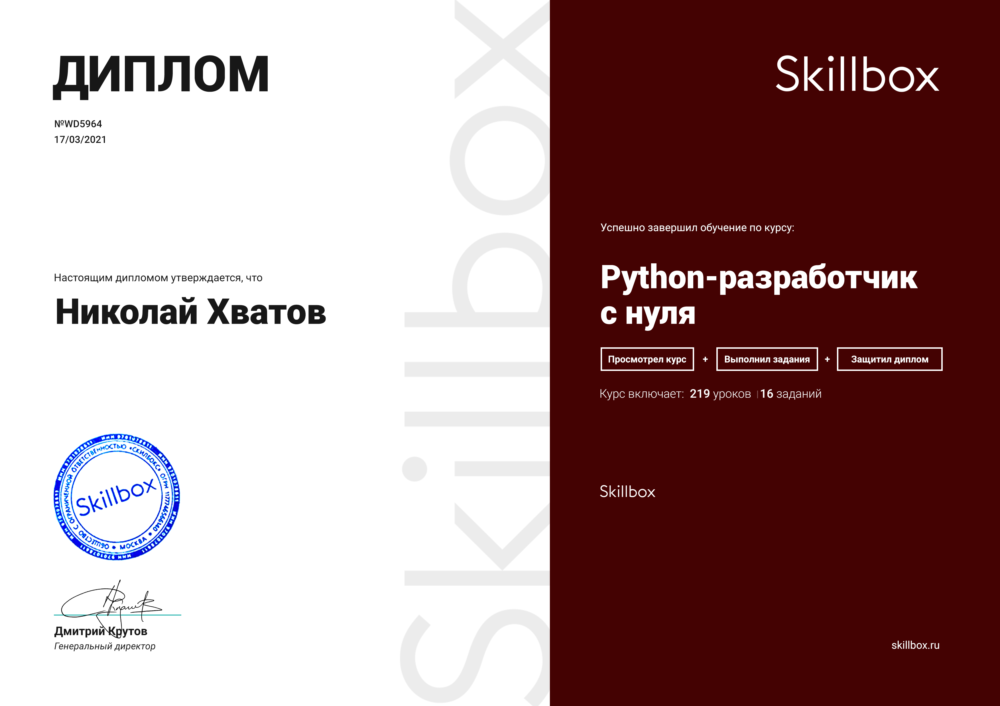

<h1 align="center">Дипломный проект курса от Skillbox <a href='https://skillbox.ru/course/python-basic/'>Python-разработчик с нуля</a></h1>

<h1 align="center">Привет </a> 
</h1>
<h3 align="center">Несколько интересных проектов, которые у меня получились в ходе прохождения курса </h3>

<h4>Бот VK для турагентства (диплом)</h4>

 Telegram-бота по заданию турагентства "Too Easy Travel". 
 Бот будет принимать примерную стоимость проживания и местонахождение пользователя, а возвращать список максимально подходящих отелей.

<h4>Чат Бот VK (учебный)</h4>

 Учебный проект на котором показывали общую идею написания ботов.

</img>

#### Итог обучения:
    1. Научился создавать программы на Python на базовом уровне
    2. Узнал что такое "чистый код"
    3. Написал первые ботов (вк)
    3. Получилось шагнуть в мир IT

